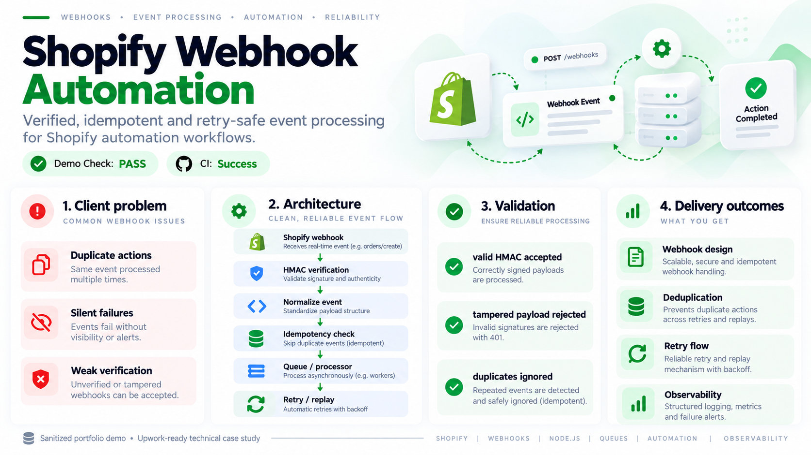

# Shopify Webhook Automation

> **Verified, idempotent and retry-safe event processing for Shopify automation workflows.**

[](https://github.com/beltebaiken-star/shopify-webhook-automation)
[](https://github.com/beltebaiken-star/shopify-webhook-automation/actions/workflows/demo-check.yml)
[](https://www.upwork.com/freelancers/baikenbelte)

## Client problem

Webhook automations can create duplicate actions or silent failures when signature verification, deduplication, fast acknowledgement and retry handling are missing.

## What this project proves

This project demonstrates HMAC verification and a resilient event-processing architecture. The runnable demo proves that a valid payload is accepted while a tampered one is rejected.

## Visual proof

The visual below summarizes the **client problem, architecture, validation logic, and delivery outcomes** for this sanitized technical case study.



## Architecture


## Quick start

```bash
git clone https://github.com/beltebaiken-star/shopify-webhook-automation.git
cd shopify-webhook-automation
npm test
```

**What the demo checks:** Creates a synthetic Shopify-style HMAC, verifies the valid raw body, then proves a tampered payload fails verification.

No Shopify credentials are required for the demo.

## What I would deliver on a client project

- Webhook endpoint design
- HMAC verification
- Event normalization
- Idempotency/deduplication
- Queue or background processing
- Retry and dead-letter strategy
- Replay/observability workflow

## Production QA principles

- Validate authentication and authorization boundaries.
- Design for retries without duplicate side effects.
- Keep external API behavior isolated from domain logic.
- Log enough context to diagnose failures without exposing secrets.
- Test failure cases and recovery paths, not only the happy path.
- Document rollout and rollback expectations.

## Repository map

```text
demo/                 runnable synthetic validation
examples/             safe implementation examples
docs/architecture.md  technical architecture notes
docs/qa-checklist.md  production verification checklist
README.md              client-facing case study
```

## Security & portfolio note

This repository is a **sanitized technical portfolio demo**. It contains no production credentials, customer data, private URLs, access tokens or proprietary client source code.

## Hire / contact

I take on focused Shopify development, API integration, automation and production troubleshooting projects.

**Upwork:** https://www.upwork.com/freelancers/baikenbelte
